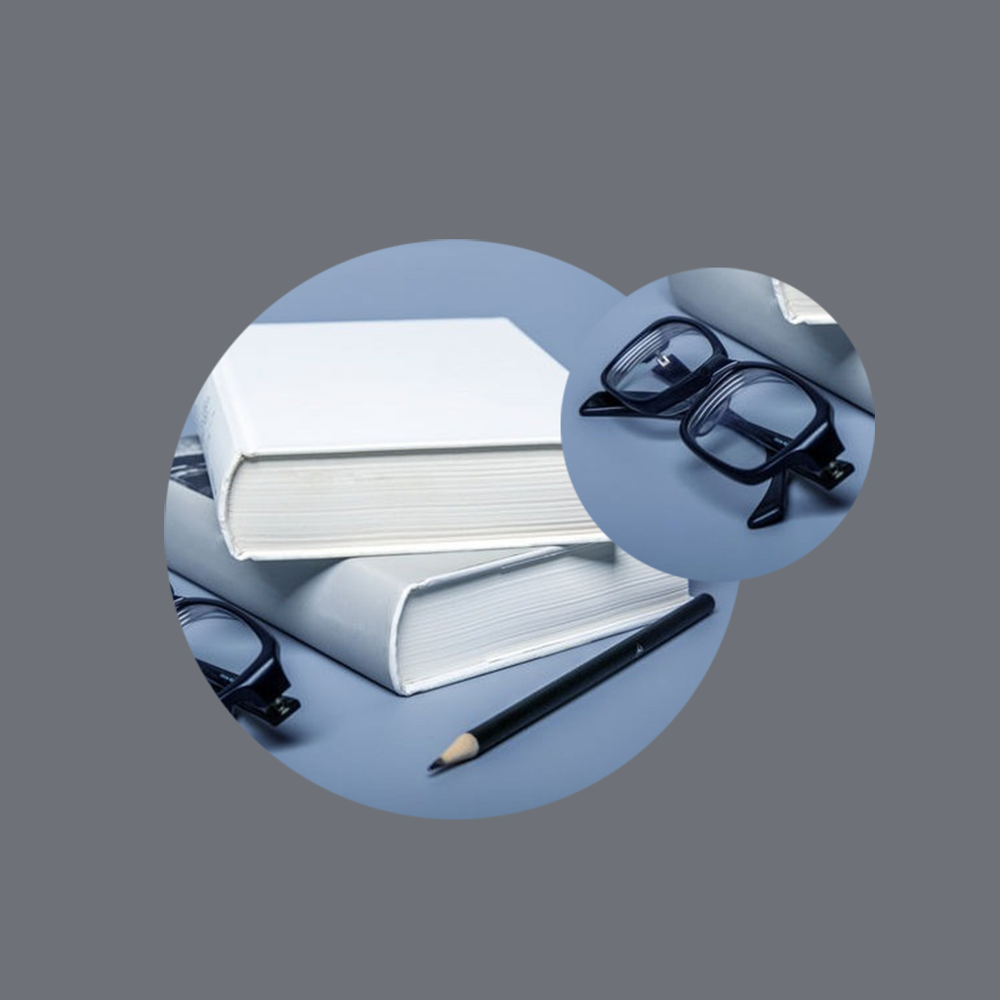

## Welcome to My Myopia Glasses Use Record

In our daily life, we often use myopia glasses. For example, when reading and studying, we need myopia glasses with high diopter to see the content clearly and the eyes will not be tired easily. When we run or exercise, we need to wear stable and fall proof glasses. We record the diopter of our myopia glasses, the use in different occasions, and the feeling and comfort of wearing them, so that we can know more conveniently whether each of our glasses is good or needs to be replaced.

If you have any questions, you can either leave a message or send the questions to our email address.

We will answer them for you in the first time.

### Address: zhanghesongyuan7@126.com

Thank you!
